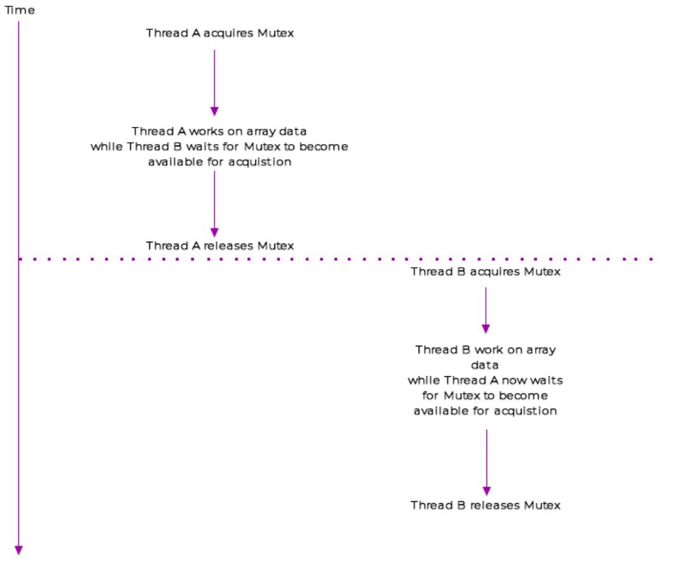
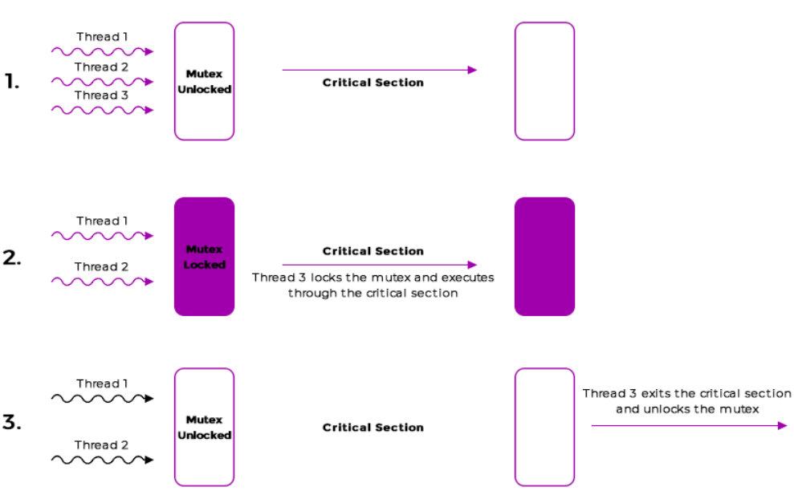
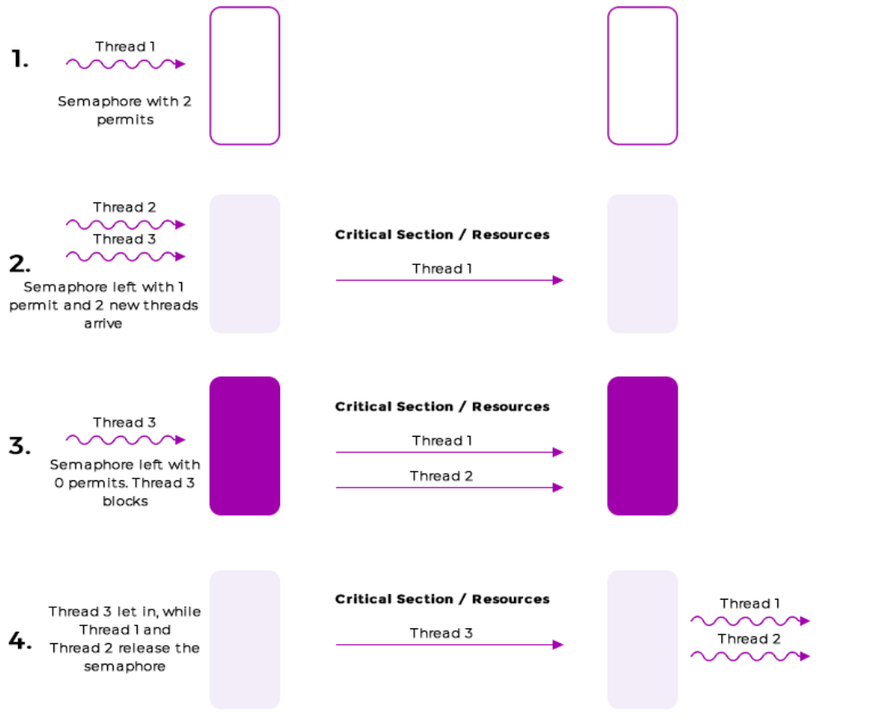
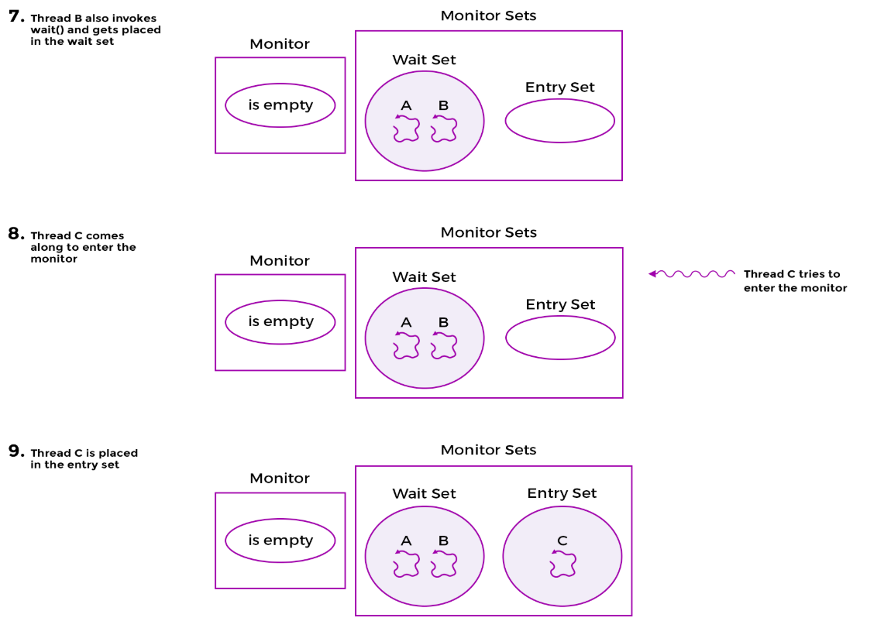
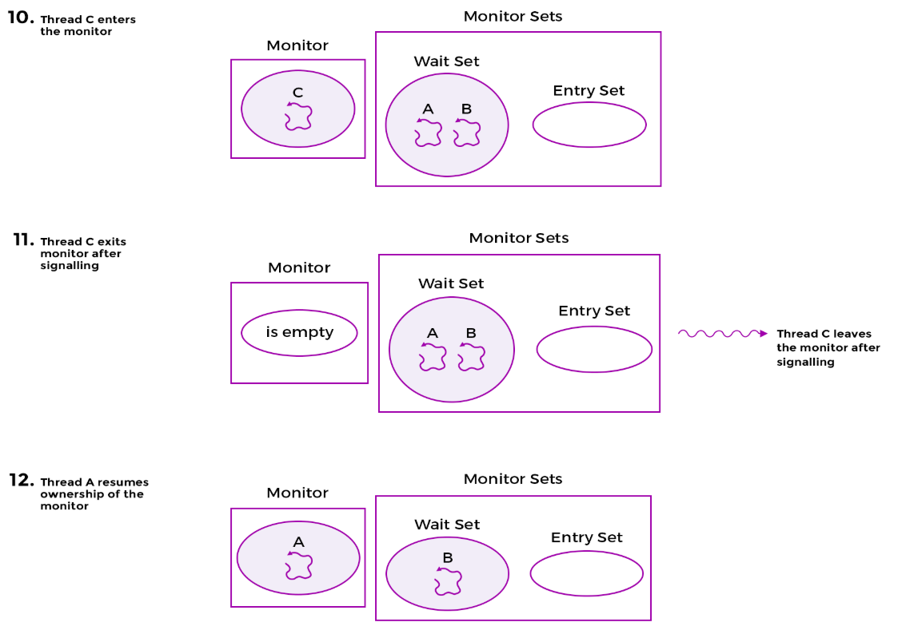
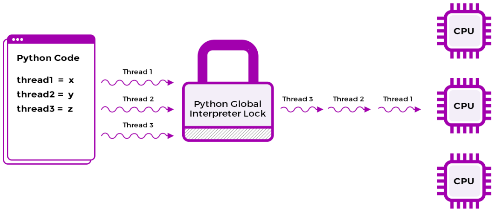

+++
title = 'Concurrency'
date = 2025-01-27T14:12:16+05:30
draft = true
+++

## Program

- Set of associated instructions that are executed sequentially.
- It consist of associated data and instructions that's loaded in the disk.
- When the program is loaded in the memory, it becomes a process.

## Process

- Process is an instance of a program that is being executed.
- It consist of instructions, user data, system data, and system resources.
- A program can have several copies running at the same time, each of which
  is a separate process.

## Thread

- A thread is the smallest unit of execution within a process which simply
  execute instructions serially.
- A thread can have same memory space as the process or it can have its own
  memory space.
- It can have a global shared memory space and accessible to all
the threads. Special care should be taken while accessing the shared memory space.

> Multi-processing systems : Multiple processes are running on multiple CPUs.
They do not share memory space. It require hardware support where a system
CPU has multiple cores or it place in a cluster of machines. Languages do provide
facilities to communicate between processes using inter-process communication.

> [!NOTE]
> Execution of threads can't be controlled by the programmer.
It is controlled by the operating system.

## Concurrency vs Parallelism

A concurrent program is decomposed into separate tasks that can be executed
out of order or in partial order.

eg. Operating system running on a single core CPU. It can run multiple processes
at the same time. It can switch between processes to give the illusion of
concurrency.

eg. Parallelism example matrix multiplication. It can be divided into smaller
sub-matrices and can be multiplied in parallel. It can be done using Multiple
CPU cores or using GPU.

Concurrency and parallelism are not the same thing. Concurrency is about dealing
with lots of things at once. Parallelism is about doing lots of things at once.
Its like two queues accessing the same printer. While parallelism is like
two queues using two printers.

## Preemptive Multitasking

- In preemptive Multitasking the operating system can preempt or interrupt
  the execution of a process or thread and allow another process or thread to run
  on the CPU.
- A program or thread can't decide when to give up the CPU. It is controlled by
  the operating system.
- The operating system scheduler decides when to switch between processes.
- A thread or the program can't decide when it will get the CPU again.This can prevent
  a thread from hogging the CPU. eg. A thread that is stuck in an infinite loop.

## Cooperative Multitasking

- In cooperative multitasking, a process or thread must voluntarily give up the
  CPU to allow another process or thread to run.
- A program or thread can decide when to give up the CPU.
- It is not used in modern operating systems as it can lead to a thread hogging
  the CPU.
- It is used in embedded systems where the program is simple and the system
  is not running multiple processes.

## Throughput and Latency

- Throughput is the number of tasks completed in a unit of time.
- eg. Instagram number of images downloaded in a second.
- Latency is the time taken to complete a task. Aka response time.
- eg. Instagram time taken to download an image.

## Synchronous vs Asynchronous

- Synchronous means line by line execution of the code.
- Synchronous code blocks at each method call before going to the next line.
- It executes the code in a sequence line by line just as it is in the source code file.

- Asynchronous means the code does not block at each method call.
- It executes the code in a sequence but it does not block at each method call.
- It allows the program to continue executing other code while waiting for the
  asynchronous code to complete.
- It is used in I/O operations where the program can continue executing other
  code while waiting for the I/O operation to complete.

## CPU Bound vs I/O Bound

- CPU bound tasks are tasks that are limited by the speed of the CPU.
- eg. Matrix multiplication, sorting algorithms.
- I/O bound tasks are tasks that are limited by the speed of the I/O devices.
- eg. Reading a file from the disk, downloading a file from the internet.
- CPU bound tasks can be parallelized to run on multiple CPU cores.
- I/O bound tasks can be made asynchronous to allow the program to continue
  executing other code while waiting for the I/O operation to complete.
- CPU bound tasks can be made asynchronous to allow the program to continue
  executing other code while waiting for the CPU bound task to complete.
- To add 1000000 numbers we can spawn 2 threads and add 500000 numbers in each
  thread and then add the result of both threads.
- slight overhead of creating threads and merging the result.

## Thread Safety

- The purpose of threading is to improve Throughput , responsiveness and latency of the code.
- If multiple threads sharing the same state among them then it becomes vulnerable to corruption.
- If we have immutable state then we don't have to worry about thread safety.
- If a single thread is writing using a single atomic bytecode instruction then it is thread safe.
- If several atomic bytecode instructions are used then it is not thread safe.

## Atomicity

Consider the following snippet.

```python
count = 0

def increment():
    global count
    count += 1
```

The above code works correctly when run in a single thread.

The statement `count += 1` is not atomic. It is a combination of three bytecode instructions.

1. Load the value of count from memory.
2. Increment the value of count.
3. Store the value of count back to memory.

We can generate the bytecode of the above code using the following command.
`dis.dis(increment)`

```sh
7 0 LOAD_GLOBAL 0 (count)
3 LOAD_CONST 1 (1)
6 INPLACE_ADD
7 STORE_GLOBAL 0 (count)
10 LOAD_CONST 0 (None)
13 RETURN_VALUE
```

In many programming languages we have constructs like mutexes, semaphores, and locks to make the code thread safe
so it can be executed sequentially by multiple threads.

## Thread Unsafe class

```python
from threading import Thread
import sys

class Counter:

    def __init__(self):
        self.count = 0

    def increment(self):
        for _ in range(100000):
            self.count += 1


if __name__ == "__main__":
    
    # Sets the thread switch interval
    sys.setswitchinterval(0.005)

    numThreads = 5
    threads = [0] * numThreads
    counter = Counter()

    for i in range(0, numThreads):
        threads[i] = Thread(target=counter.increment)

    for i in range(0, numThreads):
        threads[i].start()

    for i in range(0, numThreads):
        threads[i].join()

    if counter.count != 500000:
        print(" count = {0}".format(counter.count), flush=True)
    else:
        print(" count = 50,000 - Try re-running the program.")

```

`The count will return arbitrary value as the code is not thread safe.`
`The count should be 500000 but it will return arbitrary value.`

```python
from threading import Thread
from threading import Lock
import sys

class Counter:

    def __init__(self):
        self.count = 0
        self.lock = Lock()

    def increment(self):
        for _ in range(100000):
            self.lock.acquire()
            self.count += 1
            self.lock.release()


if __name__ == "__main__":
    
    # Sets the thread switch interval
    sys.setswitchinterval(0.005)

    numThreads = 5
    threads = [0] * numThreads
    counter = Counter()

    for i in range(0, numThreads):
        threads[i] = Thread(target=counter.increment)

    for i in range(0, numThreads):
        threads[i].start()

    for i in range(0, numThreads):
        threads[i].join()

    if counter.count != 500000:
        print(" If this line ever gets printed, " + \
        "the author is a complete idiot and " + \
        "you should return the course for a full refund!")
    else:
        print(" count = {0}".format(counter.count))

```

## Deadlock

- Deadlock is a situation where two or more threads aren't able to make
  to make any progress because the resource they need is held by another thread.
- Liveness is a ability of a program or application to execute in a timely manner.
- Deadlock is a violation of liveness.
- Live lock is a situation where two or more threads are unable to make progress
  because they are too busy responding to each other. Two guys walking towards
  each other and they keep moving to the same side to let the other pass.
- The process seem to be running but it is not making any progress.
- Starvation is a situation where a thread is unable to gain access to the
  resources it needs because other threads are hogging the resources.

Psuedo code for deadlock.

```c
void increment(){
 
  acquire MUTEX_A
  acquire MUTEX_B
    // do work here
  release MUTEX_B
  release MUTEX_A
    
}


void decrement(){
  
  acquire MUTEX_B
  acquire MUTEX_A
    // do work here
  release MUTEX_A
  release MUTEX_B
    
}

```

The above code represents a deadlock situation. If thread 1 acquires MUTEX_A and
thread 2 acquires MUTEX_B then both threads will be waiting for the other thread
to release. This will lead to a deadlock situation.

```bash
T1 enters function increment

T1 acquires MUTEX_A

T1 gets context switched by the operating system

T2 enters function decrement

T2 acquires MUTEX_B

both threads are blocked now

```

```python
from threading import *
import time

def thread_A(lock1, lock2):
    lock1.acquire()
    print("{0} acquired lock1".format(current_thread().getName()))
    time.sleep(1)
    lock2.acquire()
    print("{0} acquired both locks".format(current_thread().getName()))


def thread_B(lock1, lock2):
    lock2.acquire()
    print("{0} acquired lock2".format(current_thread().getName()))
    time.sleep(1)
    lock1.acquire()
    print("{0} acquired both locks".format(current_thread().getName()))


if __name__ == "__main__":

    lock1 = Lock()
    lock2 = Lock()

    Thread(target=thread_A, args=(lock1, lock2)).start()
    Thread(target=thread_B, args=(lock1, lock2)).start()
```

The statement acquiring lock1 and lock2 print out but there is no progress
after that and execution times out. So deadlock occur because its being acquired
in nested fashion.

## Re-entrant Lock

Re-entrant locks allows for relocking or re-entering of a Synchronization lock.
If a Synchronization primitive doesn't allow reacquisition of itself by a thread
that has already acquired it, then such thread will block as soon as it attempts
to acquire it.

```python
from threading import *


if __name__ == "__main__":
  ordinary_lock = Lock()
  ordinary_lock.acquire()
  ordinary_lock.acquire()
 
  print("{0} exiting".format(current_thread().getName()))

  ordinary_lock.release()
  ordinary_lock.release()
```

The above code will lead to deadlock. To avoid deadlock we can use re-entrant lock.

```python
from threading import *


if __name__ == "__main__":
  ordinary_lock = RLock()
  ordinary_lock.acquire()
  ordinary_lock.acquire()
 
  print("{0} exiting".format(current_thread().getName()))

  ordinary_lock.release()
  ordinary_lock.release()
```

A reentrant lock (also known as a recursive lock) is a synchronization mechanism
that allows a thread to acquire the same lock multiple times without causing a deadlock.
This is useful in scenarios where a thread needs to re-enter a critical section of
code that is already protected by the same lock.

eg. Recursive function that calls itself.

## Mutex

A Mutex means mutual exclusion. A mutex is used to guard a shared resource and
critical section of the code. It allows only one thread to access the shared
data such as an array, linked list and primitive data types.

Once a thread acquire a mutex, All other threads that try to acquire the mutex
will be blocked until the thread that acquired the mutex releases it.

Once released one of the waiting threads will acquire the mutex and continue.

## Semaphore

Semaphore on the other hand is use for limiting access to a collection of resources.
Its like limited number of permits to access the shared resource. If a semaphore has
has given all the permits then the other threads will be blocked until a permit is
released. An example would be a pool of database connection that that can be handed
out to requesting threads. Say there are ten available connections and 50 requesting
threads. Then in that case a semaphore only give out ten permit or connection at given
point.



## Can a semaphore be used as a mutex?

- A semaphore can be used as mutex if its permit is set to 1.
- The major difference between a semaphore and a mutex is that a semaphore can be
  released by a thread that didn't acquire it. A mutex can only be released by the
  thread that acquired it.
- the pthread_mutex_unlock() if a thread attempts to unlock a mutex that it didn't
  acquire then it will lead to undefined behavior.
- A semaphore can be released by any thread that has access to the semaphore.
- This leads to concept of ownership. A mutex is owned by the thread that acquired it.
- A semaphore is not owned by any thread.

## Semaphore for signaling

- A semaphore can be used for signaling between threads.
- Example of producer consumer problem the producer thread can signal the consumer
  thread by incrementing the semaphore count to indicate that there is data available
- A mutex in contrast is used to protect a shared resource. Forcing them to serialize
  access to the shared resource.





## Mutex vs Monitor

Monitor : A monitor is a synchronization construct that allows threads
to have both mutual exclusion and the ability to wait (block) for a certain
condition to become true. Monitors also have a mechanism for  signaling
other threads that a condition has been met.

```python
void busy_wait_function() {
    // acquire mutex
    while (predicate is false) {
      // release mutex
      // acquire mutex
    }
    // do something useful
    // release mutex
}
```

Within the while loop we'll first release the mutex giving other threads a
chance to acquire it, and set the loop predicate to true

The above psuedocode is an example of spin waiting. The thread keeps
acquiring and releasing the mutex until the predicate becomes true.
This works but is an example of spin waiting and it waste a lot of cpu cycles.

## Condition Variable

- Sometimes mutual exclusion is not enough.
- We want to test for a predicate with a mutually exclusive lock.
- We want to wait for a condition to become true.
- So that no other thread can change the state of the predicate while we are
  waiting for it to become true.
- If we find the predicate to be false then we can wait for the condition to
  become true.
- This is the solution to spin waiting.

- Conditional variables : A conditional variable is a synchronization primitive
  that allows threads to wait until a particular condition is true.
- Example : A producer consumer problem where the consumer thread checks if the
  buffer is empty. If it is empty then it waits for the producer thread to fill
  the buffer.
- Every conditional variable is associated with a mutex. Have the methods
  wait() and signal().
- The wait() method will cause the associated mutex to be released and the
  calling thread will placed in the wait queue.
- example, say we have a consumer thread that checks for the size of the buffer,
  finds it empty and invokes wait() on a condition variable. The predicate in
  this example would be the size of the buffer.
- If the producer produces an item and it invokes signal() on the condition
  variable then the consumer thread will be woken up and it will reacquire the
  mutex and check the predicate again.
- One of the thread from the wait queue will be woken up and it will reacquire
  the mutex and check the predicate again.
- We are not saying that it will execute immediately. It will be placed in the
  ready queue.
- It is only after the producer thread which calls the signal() method has
  released the mutex that the consumer thread can reacquire the mutex and
  check the predicate again.

```python
void efficient_waiting_function() {
    mutex.acquire()
    while (predicate == false) {
      cond_var.wait()
    }
    // Do something useful
    mutex.release()     
}

void change_predicate() {
    mutex.acquire()
    set predicate = true
    cond_var.signal()
    mutex.release()
}

```

Let's dry run the above code. Say thread A executes efficient_waiting_function() first
and finds the loop predicate is false and enters the loop. Next, thread A executes the
statement cond_var.wait() and is placed in a wait queue. At the same time thread A gives
up the mutex. Now thread B comes along and executes change_predicate() method. Since the
mutex was given up by thread A, thread B is able to acquire it and set the predicate to
true. Next, it signals the condition variable cond_var.signal(). This step places thread
A into the ready queue but thread A doesn't start executing until thread B has released
the mutex.

## Why the while loop?

If in the above snippet we replace the while loop with an if statement then the
thread will not be able to check the predicate again. The thread will be woken
up and it will acquire the mutex and check the predicate. If the predicate is
still false then the thread will go back to sleep. This is called spurious wakeup.

## Monitor Explained

- A monitor is a synchronization construct that allows threads to have both
  mutual exclusion and the ability to wait (block) for a certain condition to
  become true.
- It has two queues. One for the threads that are waiting for the mutex and
  the other for the threads that are waiting for the condition variable. Wait and
  entry queue.
- Lets say thread A is executing a method that is protected by a monitor. If
  thread B comes along and tries to execute the same method then it will be placed
  in the entry queue. If thread A gives up the mutex then thread B will be able
  to acquire the mutex and execute the method.
- If thread A invokes the wait() method on a condition variable then it will be
  placed in the wait queue. If thread B invokes the signal() method on the condition
  variable then thread A will be moved from the wait queue to the entry queue.
- The thread that is moved from the wait queue to the entry queue will not be able
  to execute the method until it acquires the mutex.
- In python a Condition object is used to implement a condition variable.
- It is also a lock object. It has the methods wait(), notify() and notifyAll().
- It allows threads to exercise control over the order of execution of threads
  that are waiting for a condition to become true.






## Mesa Monitors

- So far the idiomatic use of monitor uses a while loop to check the predicate
  and then call wait() on the condition variable.

```python
while predicate == false:
    cond_var.wait()

```

In mesa monitors it is possible that in the time interval when the thread B
calls notify() and releases its mutex and the instant at which the asleep
thread A wakes up and reacquires the mutex, the predicate is changed back
to false by another thread different than the signaler and the awoken threads!
The woken up thread competes with other threads to acquire the mutex once the
signaling thread B empties the monitor. On signaling, thread B doesn't give
up the monitor just yet; rather it continues to own the monitor until it
exits the monitor section.

## Hoare Monitor

- In Hoare monitor, the signaling thread gives up the monitor immediately
  after signaling. The woken up thread competes with the signaling thread
  to acquire the monitor. The signaling thread doesn't own the monitor
  anymore after signaling.
- if condition is true then signal() is called and the thread is woken up
  and it competes with the signaling thread to acquire the monitor.
- If the condition is false then the signaling thread gives up the monitor's
  ownership and the woken up thread acquires the monitor and checks the
  condition again.
- If the condition is true then the woken up thread will execute the code
  in the monitor. If the condition is false then the woken up thread will
  go back to sleep.
- We don't have to check using while loop in Hoare monitor.

## Difference between semaphore and monitor

- A semaphore is a signaling mechanism. It is used to signal between threads.
- A monitor is a synchronization construct that allows threads to have both
  mutual exclusion and the ability to wait (block) for a certain condition to
  become true.
- In python a Condition object is used to implement a condition variable.
- It is also a lock object. It has the methods wait(), notify() and notifyAll().
- It allows threads to exercise control over the order of execution of threads
  that are waiting for a condition to become true.
- A semaphore is used to limit access to a collection of resources.
- A semaphore can be used for signaling between threads.
- A semaphore can be used as a mutex if its permit is set to 1.
- A semaphore can be released by any thread that has access to the semaphore.
- A mutex is owned by the thread that acquired it.
- A semaphore is not owned by any thread.
- A semaphore can be used to implement a monitor.

## Global Interpreter Lock

- The Global Interpreter Lock (GIL) is a mutex that protects access to Python
  objects, preventing multiple threads from executing Python bytecodes at once.
- The GIL is necessary because CPython, the reference implementation of Python,
  is not thread-safe.

```python
import sys

# declare a variable
some_var = "Educative"

# check reference count
print sys.getrefcount(some_var)

# create another refrence to someVar
another_var = some_var

# verify the incremented reference count
print sys.getrefcount(some_var)
```

In the above code, the reference count of some_var is 2. This is because the
variable another_var is referencing the same object as some_var. The reference
count of an object is incremented each time a new reference to the object is
created. The reference count is decremented when a reference to the object is
deleted.
A reference count is associated with each object in Python. The reference count
is the number of references to the object. When the reference count of an object
reaches zero, the object is deleted from memory.
How is it related to the GIL?
The GIL is a mutex that protects access to Python objects. It prevents multiple
threads from executing Python bytecodes at once. This is necessary because CPython,
the reference implementation of Python, is not thread-safe. The GIL ensures that
only one thread can execute Python bytecodes at a time. This is done to prevent
the reference count of Python objects from being corrupted by multiple threads
accessing the same object simultaneously.

GIL can't be removed because it is a part of the CPython implementation. It it
removed then it will break the existing CPython code. It is possible to write
a Python interpreter without the GIL. Jython and IronPython are examples of
Python interpreters that don't have the GIL.
It is intended to serialize access to Python objects, not to prevent threads
from running concurrently. It is possible to write multi-threaded Python
programs that run concurrently using the multiprocessing module.



## Amdahl Law

- Amdahl's law is a formula that describes the theoretical maximum speedup
  that can be achieved by parallelizing a computation.
- The formula is used to predict the speedup of a program when running on
  multiple processors.
- The formula is named after Gene Amdahl, a computer architect who first
  proposed it in 1967.
- The formula is given by the equation: Speedup =

> 1 / (1 - P) + P / N

- Where P is the fraction of the program that can be parallelized and N is
  the number of processors.
- The formula shows that the speedup of a program is limited by the fraction
  of the program that can be parallelized. If the program is 100% parallelizable,
  then the speedup is linear with the number of processors. If the program is
  only 50% parallelizable, then the speedup is limited to a factor of 2, regardless
  of the number of processors.
- The formula is used to predict the speedup of a program when running on multiple
  processors. It is used to determine the optimal number of processors to use for
  a given program.
Example :  Suppose a program has a parallelizable fraction of 0.8 and is run on
a machine with 4 processors. The speedup of the program is given by the formula:
1 / (1 - 0.8) + 0.8 / 4 = 5 times. The speedup of the program is 5 times when
run on 4 processors. The speedup of the program is limited by the fraction of the
program that can be parallelized. If the program is 100% parallelizable, then the
speedup is linear with the number of processors. If the program is only 50% parallelizable,
then the speedup is limited to a factor of 2, regardless of the number of processors.

## Moore's Law

- Moore's Law is the observation that the number of transistors on a microchip
  doubles approximately every two years.
- The law is named after Gordon Moore, the co-founder of Intel, who first
  observed the trend in 1965.
- Moore's Law is often used to predict the performance of computer hardware
  over time. It is used to estimate the rate of improvement in processor speed,
  memory capacity, and other aspects of computer hardware.
- The law has held true for over 50 years, but there are concerns that it may
  be reaching its limits. As transistors become smaller and more densely packed,
- it becomes increasingly difficult to maintain the rate of improvement predicted
  by Moore's Law.
- The law is not a physical law, but an empirical observation based on historical
  trends in the semiconductor industry. It is not a guarantee of future performance,
  but a prediction based on past performance.
- Moore's Law has been a driving force in the development of computer hardware
  over the past half-century. It has led to the development of faster, smaller,
  and more powerful computers, and has enabled the growth of the technology industry
  as a whole.
- The law has been used to predict the rate of improvement in processor speed,
  memory capacity, and other aspects of computer hardware. It has been a key factor
  in the development of new technologies and the growth of the technology industry.
